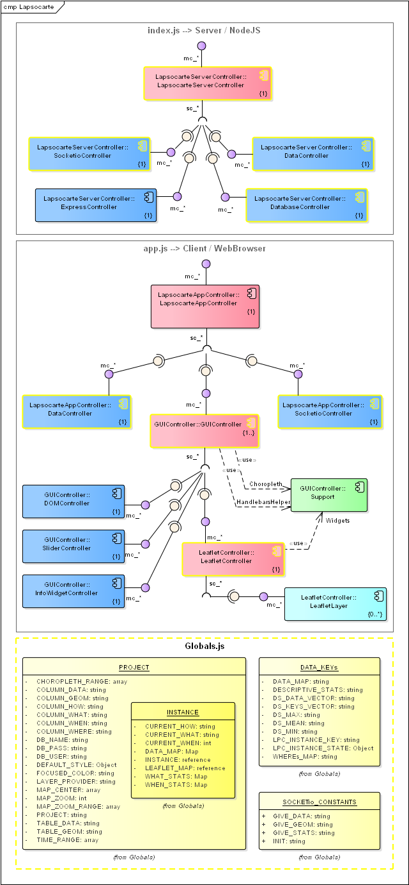
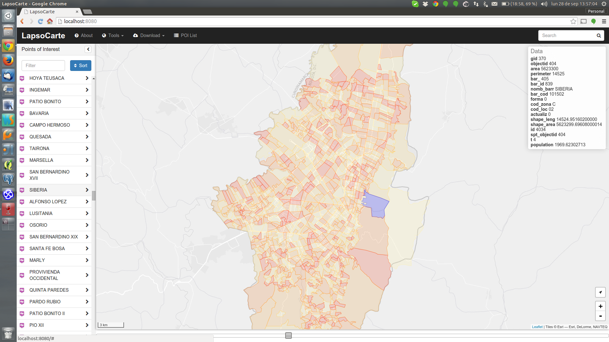

# LapsoCarte

LapsoCarte is a web-based visual tool to interact with time-space referenced data.

The backend is based on:
- **PostGIS** as a database engine.
- **NodeJS 0.12** as a server-side platform.
- [GeoTabulaDB](https://github.com/tabulaco/geotabuladb) between NodeJS and PostGIS.

The frontend is a fork of [BootLeaf](https://github.com/bmcbride/bootleaf) and requires:
- **jQuery**
- **Bootstrap**
- **LeafletJS**
- jQuery-ui
- Typeahead
- Handlebars
- ListJS

Most of LapsoCarte code is written in **ECMAScript 6** and uses **Babel** for backward compatibility.

## Code Patterns
- [EAFP](https://docs.python.org/2/glossary.html#term-eafp): Easier to ask for forgiveness than permission.
- [Mediator Pattern](http://addyosmani.com/largescalejavascript/): Each submodule has its own mediator, who manages all interaction between all its decedent modules and its own main module. Each mediator **must initialize all his decedent modules and save a reference to them**, otherwise the submodule will be destroyed along with its state.
 - The client-side main mediator is [app.js](app/app.js).
 - The server-side main mediator is [index.js](server/index.js).

## Architecture

- Module mediators are in red.
- First request (client-side) information flow is represented by black arrows.
- User interaction with the slider is represented by green arrows.

## Workspace Setup (Ubuntu 14.04)
### Packages Installation
```bash
# Postgres
sudo apt-get install postgresql postgresql-contrib postgresql-client pgadmin3
sudo apt-get install postgis postgresql-9.3-postgis-scripts

# Change postgres auth method
sudo sed -i 's&local   all             all                                     peer&local   all             all                                     md5&g' /etc/postgresql/9.3/main/pg_hba.conf
sudo service postgresql restart
```
For details on how to install NodeJS 0.12 please refer to [NODESOURCE](https://nodesource.com/blog/nodejs-v012-iojs-and-the-nodesource-linux-repositories).

### App setup and NPM dependencies
```bash
cd pathToProjectRoot
git clone https://github.com/vargax/lapsoCarte.git
cd lapsoCarte

# Install npm modules
sudo npm install -g napa babel browserify
npm install

# Publish node_modules folder
cd app/public/
mkdir node_modules
cd node_modules
ln -s ../../../node_modules/font-awesome .
ln -s ../../../node_modules/jquery-ui .
```

### PostGIS setup
```bash
cd drivers
chmod +x create_user.sh
sudo ./create_user.sh lapsocarte
```
The `create_user.sh` script will create a new postgresql user *lapsocarte* with password *lapsocarte* in *localhost*. Then it will create the database *lapsocarte* and enable the PostGIS extension on it.
The idea is to have one PostgreSQL user and database per project.

### Globals
The [Globals.js](Globals.js) define a JavaScript object with all the required parameters for a given project. It is possible to change between projects changing the `export const PROJECT` constant.
  You must recompile and rerun the application to see the changes:
  ```bash
  # Compile client-side libraries
  npm run build
  # Server run
  node bootstrap.js
  ```

## App Execution
### Sample data database load
```bash
cd drivers
chmod +x shp+csv.sh
./shp+csv.sh
```
### Project build and execution
```bash
# Compile client-side libraries
npm run build
# Server run
node bootstrap.js
```
### Sample Screenshot

