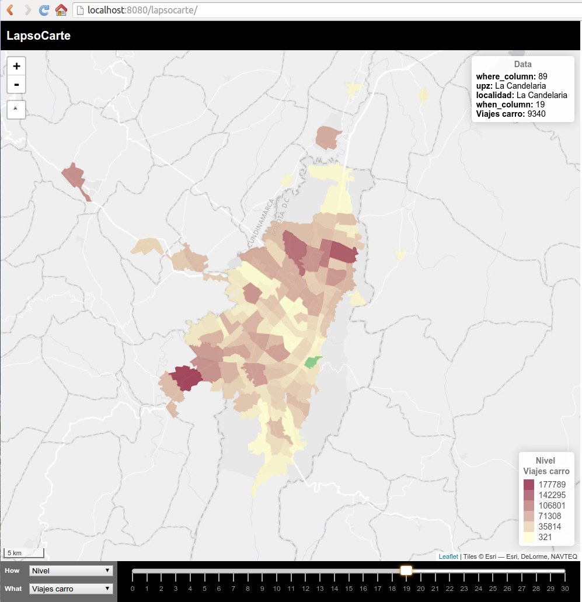

# LapsoCarte

**LapsoCarte** is a web platform to visualize and interact with temporal and spatial referenced data. It is build over a simple data storage structure which enable a flexible and problem agnostic representation.

The backend is based on:
- [**PostGIS**](http://postgis.net/) as a database engine.
- [**NodeJS 0.12**](https://nodejs.org/en/) as a server-side platform.
  - [Express](http://expressjs.com/) as a web framework.
  - [Socket.oi](http://socket.io/) to manage socket communications.
- [GeoTabulaDB](https://github.com/tabulaco/geotabuladb) between NodeJS and PostGIS.
- [jStat](https://github.com/jstat/jstat) to calculate descriptive statistics.

The frontend is based on:
- [**LeafletJS**](http://leafletjs.com/) to represent WHEREs (spatial dimension).
- [**noUiSlider**](http://refreshless.com/nouislider/) to represent WHENs (temporal dimension).
- [jQuery](https://jquery.com/) to handle web browser events.
- [Less](http://lesscss.org/) to compile the CSS stylesheets.
- [Handlebars](http://handlebarsjs.com/) to manage HTML templates.

*LapsoCarte* code is written in **ECMAScript 6** and uses [**Babel**](https://babeljs.io/) for backward compatibility.

## Dimensions
Data is stored, indexed, retrieved and explored in a generic [four dimensional schema](https://github.com/vargax/lapsocarte/wiki/LapsoCarte#dimensions):

- **How**: Main grouping level to differentiate between data types or alternatives. *Hows* are represented as strings.
- **What**: Secondary grouping level to differentiate between data sets. *Whats* are represented as strings.
- **When**: Temporal dimension. *Whens* are enumerable and sortable elements, represented as integers.
- **Where**: Spatial dimension. *Wheres* are geometries represented as points, lines, polylines or polygons.

A *driver* is the bridge between data producers and the dimension based structure *LapsoCarte* relies on. *LapsoCarte* uses a [data level integration strategy](https://github.com/vargax/lapsocarte/wiki/LapsoCarte#drivers) to deal with different data sources.

## Client and Server Logic
The back-end retrieves data and compute descriptive statistics from a Postgres database. The server logic depends on a [given database structure](https://github.com/vargax/lapsocarte/wiki/LapsoCarte#server-side-data-model) of two tables:
 - **Main data table**: This table has five columns, one for each dimension plus the data itself. The primary key is a compound key of the four dimensions.
 - **Geometries table**: This table is used to normalize the geometries data.

The front-end provides an [intuitive interface](https://github.com/vargax/lapsocarte/wiki/LapsoCarte#graphical-interface) to explore data through a slider for the *when* or temporal dimension and a map for the *where* or spatial dimension. In the front-end data exploration follows an hierarchical structure: *How*, *What*, *When*, *Where*.

Full application's [architecture](https://github.com/vargax/lapsocarte/wiki/LapsoCarte#architecture) and [implementation](https://github.com/vargax/lapsocarte/wiki/LapsoCarte#putting-it-all-together) details are available on project's [wiki](https://github.com/vargax/lapsocarte/wiki).

## Globals
The [Globals.js](Globals.js) define a JavaScript object with all the required parameters for a given project. It is possible to change between projects changing the `export const PROJECT` constant.
You must recompile and rerun the application to see the changes:
  ```bash
  # Compile client-side libraries
  npm run build
  # Server run
  node bootstrap.js
  ```

Read more about Globals [here](https://github.com/vargax/lapsocarte/wiki/LapsoCarte#shared-global-objects).

# Workspace Setup (Ubuntu 14.04)
## Packages Installation
```bash
# NPM and drivers dependencies
sudo apt-get install unzip build-essential

# Postgres & PostGIS
sudo apt-get install postgresql postgresql-contrib postgresql-client
sudo apt-get install postgis postgresql-9.3-postgis-scripts

# Change postgres auth method
sudo sed -i 's&local   all             all                                     peer&local   all             all                                     md5&g' /etc/postgresql/9.3/main/pg_hba.conf
sudo su postgres <<EOF
psql -c "REVOKE CONNECT ON DATABASE template1 FROM PUBLIC;"
EOF
sudo service postgresql restart
```
For details on how to install NodeJS 0.12 please refer to [NODESOURCE](https://nodesource.com/blog/nodejs-v012-iojs-and-the-nodesource-linux-repositories).

## App setup and NPM dependencies
```bash
cd pathToProjectRoot
git clone https://github.com/vargax/lapsocarte.git
cd lapsocarte

# Install npm modules
sudo npm -g update
sudo npm install -g napa babel browserify less
npm install

# Publish node_modules folder
cd app/public/
mkdir node_modules
cd node_modules
ln -s ../../../node_modules/font-awesome .
```

## PostGIS setup
```bash
cd drivers
sudo ./create_user.sh demo
```
The `create_user.sh` script will create a new postgresql user *demo* with password *demo* in *localhost*. Then it will create the database *demo* and enable the PostGIS extension on it.
The idea is to have one PostgreSQL user and database per project.

## Sample data load
```bash
cd drivers
sudo ./create_user.sh demo
cd generic_csv
./csv_driver.sh # PostgreSQL demo user's password is demo
```

## Project build and execution
```bash
cd ../../ # Go up to project root
# Compile client-side libraries
npm run build
# Server run
node bootstrap.js
```

## Screenshot

